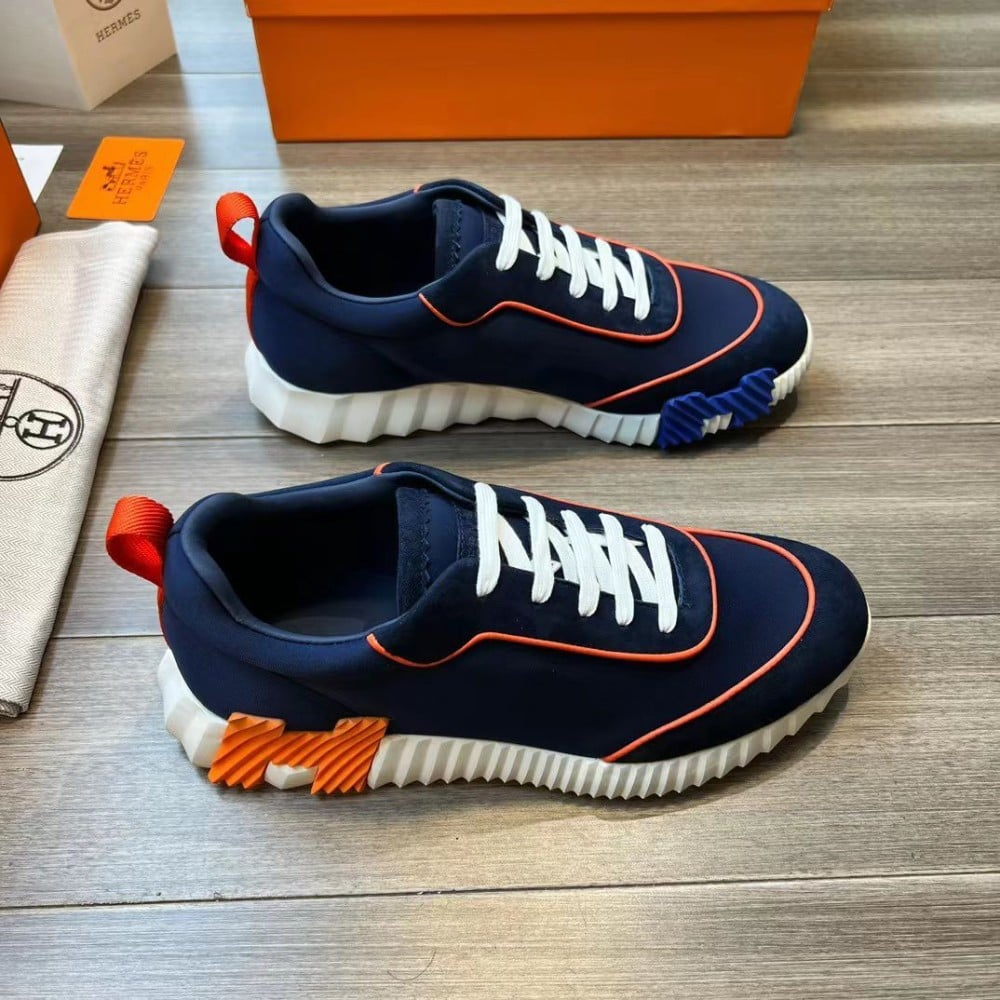
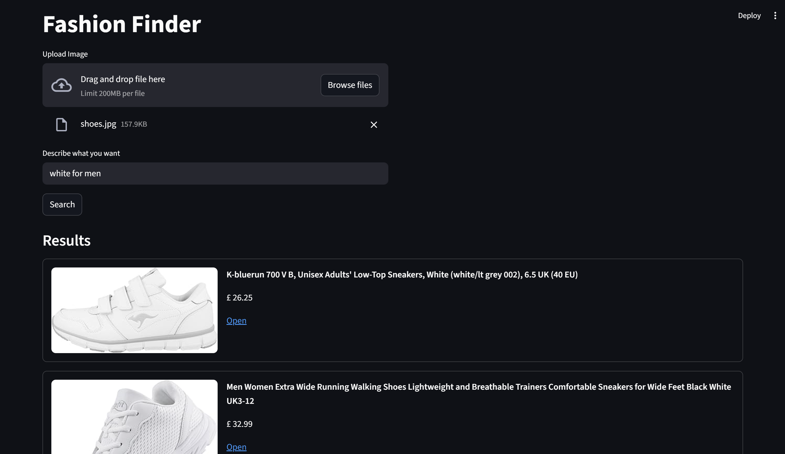
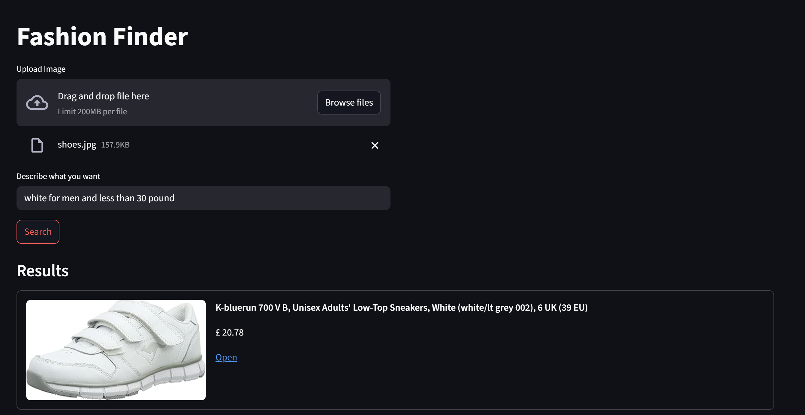
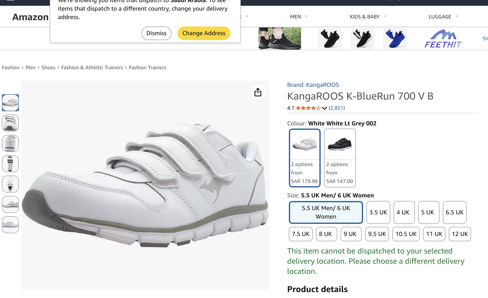

# 👗 Fashion Finder

## Project Idea

Fashion Finder is an AI-powered search system that helps users find fashion products using:

* Image search
* Text search
* Image + text combined

Instead of keyword search, the system uses **semantic similarity** to retrieve relevant items from a product database.

---

## RAG Approach

The system uses:

**Text-based RAG with Image-to-Text Query Expansion**

Images are not embedded directly.
Instead:

* The image is converted into a caption and attributes using an LLM.
* The generated text is embedded and used for retrieval.

Retrieval is followed by:

* Rule-based filtering
* LLM reranking.

---

## Models Used

### Embeddings

* `text-embedding-3-small`

### Vision & LLM

* `gpt-4o-mini`

Used for:

* Image captioning
* Attribute extraction
* Constraint extraction
* Result reranking

---

## Tools & Technologies

* Python
* Streamlit
* LangChain
* FAISS Vector Database
* OpenAI API

---

## Dataset

Amazon UK Products Dataset (Kaggle)

Processing:

* Removed missing values
* Filtered fashion categories (Men / Women)
* Price range filtered (£1–£2000)
* Sample size ≈ 50k products

---

## Vector Database

Stored locally in:

```
index/
├── index.faiss
├── index.pkl
├── meta.jsonl
```

---

## System Workflow

1. Convert image → caption + attributes
2. Extract constraints from text query
3. Build combined search query
4. Retrieve candidates using MMR search
5. Apply filtering
6. Rerank using LLM

---

## Example Results
I upload shoes image 

* When searching using a **shoe image + the word "white"**, the system returned matching **white shoes**.

* After adding a **price constraint**, the results were automatically filtered to show only **lower-priced items**.

* Additionally, clicking the link will take you to the Amazon page
  
  
---

## Author

Lyane
